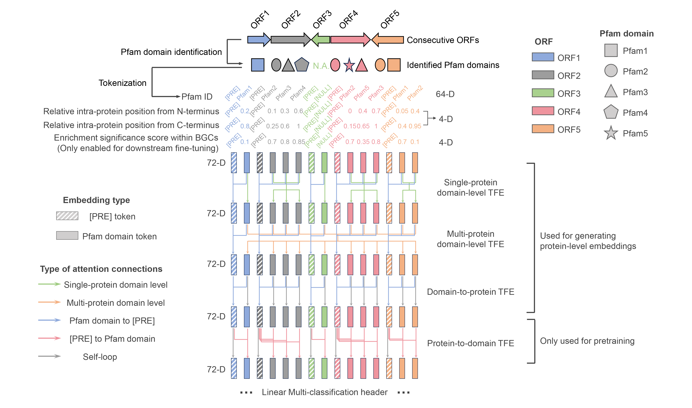
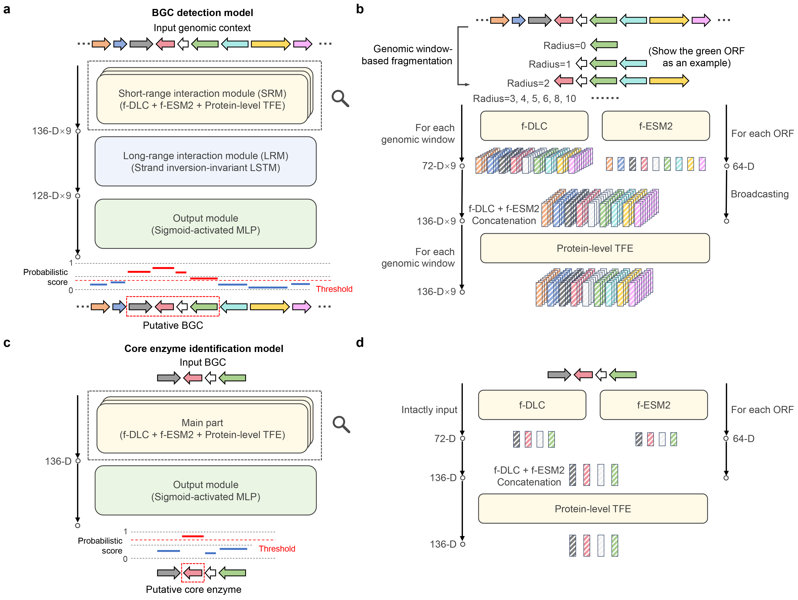

# f-BGM enables fungi-specific genome mining in high accuracy and interpretability
[](LICENSE)
[](https://doi.org/10.6084/m9.figshare.29396423.v1)
[](xxx)
[]()

## Briefing
Benifit by recent data accumulation of fungal biosynthetic gene clusters (BGC), here we proposed a deep learning framework specifically for the fungal genome mining problem, termed as f-BGM. By designing a novel self-attention-based pretrained model acquiring the knowledge of inter-Domain Locally Co-occurrent relationship in Fungal genome (f-DLC), f-BGM outperforms existing baselines in both (1) BGC detection and (2) core enzyme identification tasks. In addition, attention weight-based analyses demonstrate that f-BGM is of decent interpretability on deciphering single-domain and -protein importance as well as inter-domain partnership.

## Model architecture
### The f-DLC architecture

f-DLC receives ≤26 consecutive ORFs as inputs. First, f-DLC transforms the ORFs into linearized token sequences with a hierarchical domain-to-protein structure, which consists of Pfam domain tokens prefixed with [PRE] token for each ORF. Then the tokens are translated into 72-D embeddings consisting of three components: (1) 64-D domain-specific learnable embeddings; (2) 4-D embeddings encoding domains’ relative positioning information in protein; (3) 4-D embeddings encoding domains’ enrichment information in BGC (only enabled during downstream establishment of f-BGM). Next, the embeddings are passed through four sequential transformer encoders (TFE) with different attention masks to achieve layer-wise information interaction. Specifically, the first and second TFE mainly focus on inter-domain information interaction within single protein and multiple proteins, respectively. Meanwhile the attention connections from domain tokens to corresponding prefix tokens are enabled for real-time domain-to-protein information aggregation. The third TFE only retains the domain-to-protein attention mechanism to fully summarize the upstream extracted features and thereby generate meaningful protein-level embeddings for downstream use. The fourth TFE reversely calculates on the attention connections from prefix tokens to domain tokens to satisfy domain-level BERT-style pretraining, where 15% of the input domain tokens are masked and the model is guided to recover these tokens by a downstream multi-classification header.

### The f-BGM architecture

**a** The BGC detection model receives genomic contexts as input and outputs ORF-level probabilistic scores representing BGC membership. The entire process consists of three sequential steps: (1) self-attention-based short-range information interaction (by SRM), (2) long-short-term memory (LSTM)-based long-range information passing (by LRM) and (3) probabilistic score generation (by OM). **b** Detailed illustration of the SRM. SRM integrates two pretrained models respectively capturing (1) inter-domain locally co-occurrent relationship in fungal genome (f-DLC) and (2) amino acid patterns within fungal protein sequences (f-ESM2). The input genomic contexts are first fragmented into multiple sizes of genomic windows and fed into f-DLC to enable domain-level information interaction and generate window-wise ORF-level embeddings, meanwhile the ORF-encoded protein sequences are passed into f-ESM2. The f-DLC-output embeddings and broadcasted f-ESM2-output embeddings are further concatenated and fed into an additional transformer encoder for protein-level information interaction (protein-level TFE). **c** The core enzyme identification model receives BGCs as input and outputs ORF-level probabilistic scores representing the presence or absence of target core enzymes. **d** The main part of core enzyme identification model mimics the SRM architecture in (**b**) but without genomic window-based fragmentation on the input BGCs due to their determined borders.

## Toolkit installation and initial configuration
This toolkit was developed for Linux systems due to dependencies on some UNIX-specific bioinformatics packages (e.g., HMMER).
### Repository cloning
(1) Clone this repository to local machine: 
```
~/user/path# git clone https://github.com/bingozhyr/f-BGM.git
```
(2) Navigate into the project directory:
```
~/user/path# cd f-BGM
~/user/path/f-BGM# ls
LICENSE  README.md  demo  docs  environment.yml  f-bgm.py  img  src
```
### Download model parameters and external files
This repository only contains the python source code. The (1) trained model parameters and (2) external files for Pfam domain identification are seperately deposited in [figshare](https://doi.org/10.6084/m9.figshare.29396423.v1) as 'model.zip' (1.05GB) and 'external_file.zip' (786.02MB), respectively. The users should (1) download and move them into the project directory and (2) unzip them. The complete project is as follow:
```
~/user/path/f-BGM# ls
LICENSE  README.md  demo  docs  environment.yml  external_file  f-bgm.py  img  model  src
```
### Environment configuration
We strongly recommend the users to configure f-BGM runtime environment using Conda (available at [here](https://www.anaconda.com/download/)), which is professional for dependency conflict solvement and multiple environment management.
#### Option 1: automatic configuration (recommended):
Directly create a virtual environment namd 'f-BGM' according to the pre-defined configuration file 'environment.yml':
```
(base) ~/user/path# conda env create -f ~/user/path/f-BGM/environment.yml
```
#### Option 2: step-by-step manual configuration:
#### 1. Preparation
(1) Create a virtual environment specifically for f-BGM execution, here the environment is named as 'f-BGM' for demonstration:
```
(base) ~/user/path# conda create -n f-BGM
```
(2) Switch to the f-BGM environment:
```
(base) ~/user/path# conda activate f-BGM
(f-BGM) ~/user/path#
```
#### 2. Formal configuration of f-BGM runtime environment (installation of python and dependent packages)
(1) Install the packages deposited in Conda channels:
```
(f-BGM) ~/user/path# conda install python==3.10.13 pandas==1.3.5 biopython==1.82 pyhmmer==0.8.1 augustus==3.5.0 plotly==5.18.0 bokeh==3.3.4 pytorch==2.2.0 torchvision==0.17.0 torchaudio==2.2.0 pytorch-cuda=11.8 pandas==1.3.5 biopython==1.82 -c conda-forge -c bioconda -c pytorch -c nvidia
```
(2) Install the packages deposited in PyPI:
```
(f-BGM) ~/user/path# pip install fair-esm==2.0.0 pygustus==0.8.3
```
## Perform fungal genome mining using f-BGM
### Basic usage
(1) Switch to the f-BGM environment:
```
(base) ~/user/path# conda activate f-BGM
(f-BGM) ~/user/path#
```
(2) Formally use f-BGM. The basic usage of f-BGM command is:
```
f-bgm.py -s SEQUENCE [-a ANNOTATION] -p PATH --pred_score_top_ratio PRED_SCORE_TOP_RATIO
```
Three parameters '-s', '-p' and '--pred_score_top_ratio' are required to be specified. The parameter '-s' indicates the genome sequence file to be analyzed, the supported formats include (1) genbank (\*.gbk, \*.gb and \*gbff) and (2) fasta (\*.fa, \*.fasta and \*.fa). If a genbank file is provided, then it will undergo strict validity check, please confirm its consistency with [the demo file](demo/demo.gbff) in data fields. If the file is of fasta format (recommended), then a genomic annotation file in gff3 format (\*.gff and \*.gff3) can be optionally provided through the parameter '-a'. On this occasion validity check will be also performed, please confirm its format consisitency with [the demo file](demo/demo.gff3). If the fasta file is provided without specified '-a', then the toolkit will automatically invoke the AUGUSTUS tool for *de novo* generation of genome annotations.

'-p' is the working path for the genome mining task, all the intermediate and final results will be generated in it.

'--pred_score_top_ratio' is the top ratio of highly scored ORFs considered for BGC organization. 

For example, if a genome sequence file in fasta format and a valid genome annotation file in gff3 format are both present, then the users can use the following commond to organize the top 5% of highly scored ORFs into putative BGCs:
```
(f-BGM) ~/user/path# python ~/user/path/f-BGM/f-bgm.py -s /user/path/genome/sequence/file.fasta -a /user/path/genome/annotation/file.gff3 -p /user/path/genome/mining/task --pred_score_top_ratio 0.05
```
If the users only have a fasta file, then the abscent '-a' is also feasible with the assistance of AUGUSTUS:
```
(f-BGM) ~/user/path# python ~/user/path/f-BGM/f-bgm.py -s /user/path/genome/sequence/file.fasta -p /user/path/genome/mining/task --pred_score_top_ratio 0.05
```
### Other parameters
See the help messages to understand the usages of other parameters:
```
(f-BGM) ~/user/path# python ~/user/path/f-BGM/f-bgm.py -h
```
## Deciphering genome mining results of f-BGM
### Basic information of putative BGCs
For each genome mining task, a file ['putative_BGC.csv'](demo/fbgm_working_path/prediction_result/1750899275/putative_BGC.csv) will be first generated, where the basic information of f-BGM-putative BGCs including genomic locus, member ORF number, putative core enzymes, Pfam domain components and confidence score are recorded.
### Detailed information of putative BGC-containing contigs
For each putative BGC-containing contig, 2 interactive html images will be generated:

(1) ['contig_id.confidence_score.html'](https://bingozhyr.github.io/f-BGM/ML978066.confidence_score.html), which illustrates ORF-level confidence scores of BGC membership.

(2) ['contig_id.putative_BGC.html'](https://bingozhyr.github.io/f-BGM/ML978066.putative_BGC.html), which illustrates putative BGCs' genomic spans and Pfam domain components.
### Detailed information of putative BGCs
For each putative BGC, 5 files will be generated:

(1) ['putative_BGC_id.dna.fasta'](demo/fbgm_working_path/prediction_result/1750899275/putative_BGC_detail/BGC_2.dna.fasta), which records corresponding DNA sequences in fasta format.

(2) ['putative_BGC_id.pfam.json'](demo/fbgm_working_path/prediction_result/1750899275/putative_BGC_detail/BGC_2.pfam.json), which records Pfam domain components of each member protein in json format.

(3) ['putative_BGC_id.attention_intra_pep_pfam_level.html'](https://bingozhyr.github.io/f-BGM/BGC_2.attention_intra_pep_pfam_level.html), which interactively illustrates inter-domain attention flows within single protein, as revealed by single-protein domain-level TFE of f-DLC.

(4) ['putative_BGC_id.attention_multi_pep_pfam_level.html'](https://bingozhyr.github.io/f-BGM/BGC_2.attention_multi_pep_pfam_level.html), which interactively illustrates inter-domain attention flows within multi-proteins, as revealed by multi-protein domain-level TFE of f-DLC.

(5) ['putative_BGC_id.attention_pep_level.html'](https://bingozhyr.github.io/f-BGM/BGC_2.attention_pep_level.html), which interactively illustrates inter-protein (inter-ORF) attention flows, as revealed by protein-level TFE of f-BGM SRM.
